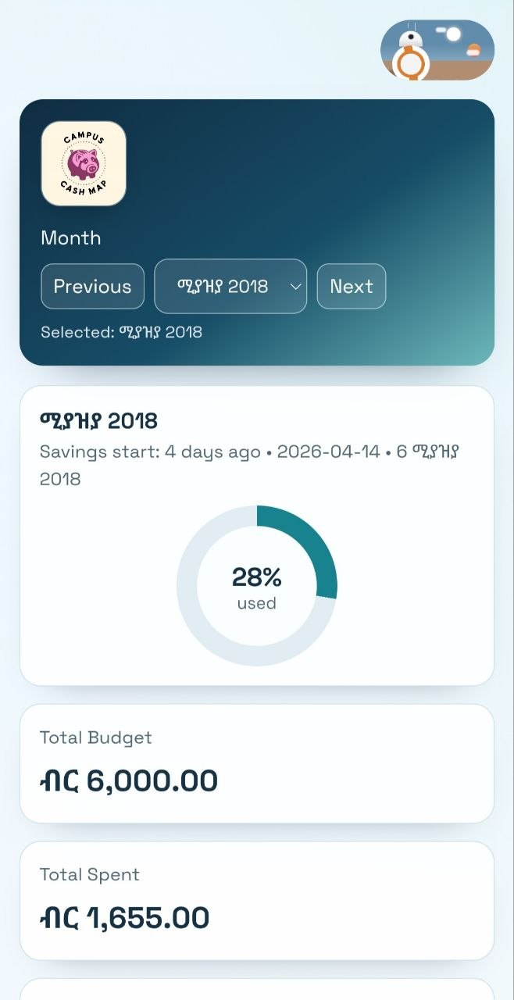
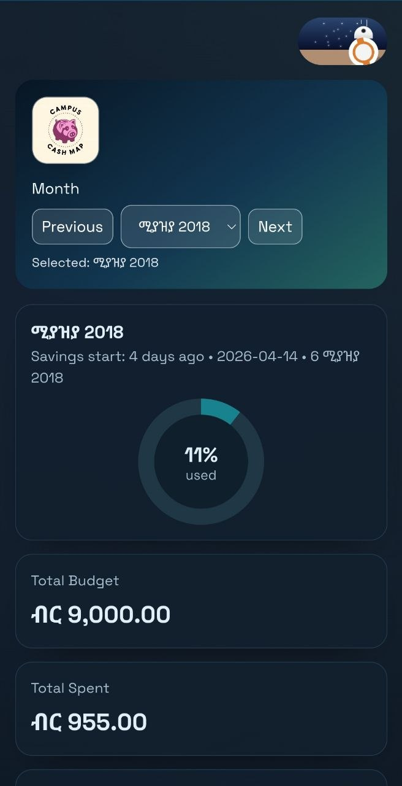

# CampusCashMap


Login-free Progressive Web App for student budget management.

Live site: [https://campuscashmap.web.app](https://campuscashmap.web.app)

## Overview

CampusCashMap helps students plan monthly budgets, track spending, and understand where their money goes without creating an account.

The app is designed to be:
- Fast on mobile
- Private by default (local-only data)
- Useful offline as an installable PWA
- Localized for Ethiopian users (ETB + Ethiopian date support)

## Screenshots

<table>
	<tr>
		<td align="center" width="50%">
			
		</td>
		<td align="center" width="50%">
			
		</td>
	</tr>
</table>

## Features

- Monthly budget setup and tracking
- Expense creation with title, amount, category, date, and optional notes
- Instant summary metrics: spent, remaining, and over-budget status
- Circular budget-usage visualization
- Month-by-month data isolation
- Category spending breakdown chart
- ETB currency display and Ethiopian calendar-aware dates
- Dark/light mode toggle
- Installable PWA with offline support
- Local data persistence using `localStorage`

## PWA Installation

| Platform | How to install |
| --- | --- |
| Android (Chrome/Edge) | Tap the in-app Install button or browser menu -> Install app |
| iOS (Safari) | Share -> Add to Home Screen |
| Desktop (Chrome/Edge) | Click the install icon in the address bar |

## Tech Stack

- React 19
- Vite 7
- Plain CSS
- `vite-plugin-pwa`
- Firebase Hosting
- `ethiopian-date`
- ESLint (flat config)

## Local Development

Prerequisites:
- Node.js 18+
- npm

Install and run:

```bash
npm install
npm run dev
```

Open the local URL shown in your terminal (typically `http://localhost:5173`).

Build for production:

```bash
npm run build
```

Preview production build locally:

```bash
npm run preview
```

## Available Scripts

```bash
npm run dev      # Start development server
npm run build    # Build production assets
npm run preview  # Preview production build
npm run lint     # Run ESLint
```

## Privacy

CampusCashMap does not require sign-in and does not store user budgets on a server. Budget and expense data remain in your browser storage.

## License

Private project.
